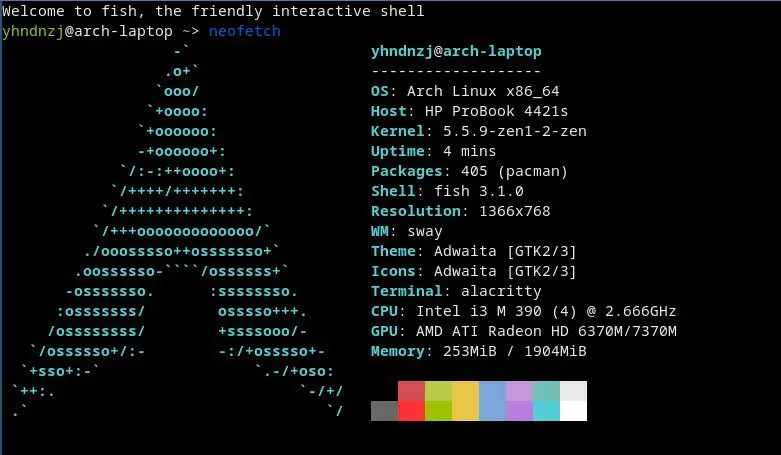

> 距離上一次聊到自己的個人生活，已經過去了兩年半之久（當時還是 2020，新冠疫情剛剛爆發，初三集體上網課的時間呢）；回看那時寫下的記錄從小到大折騰電腦的自己的文字，~~雖然可能有些「中二」（~~，還是令我感慨萬千的（其實是個很懷舊的人））。加之，在初三下學期到準高三的這兩年半的時間裏，還是有許多值得記憶的事情的；而且，在高三可能要提前開學的當下，這可能是爲數不多的更新 blog 的時間了（）。於是，或許就算是當作留給以後的自己回憶的材料，今天打算寫下這些文字。
> <!-- more -->

說是「近況」，其實這兩年半感受的時間跨度，對於我來說可能比之前的十幾年加起來還長呢（。從初三下學期到高二升高三的暑假，真是發生了許多。以下分小標題（

## 上一次的補完

在上一篇 [systemd-oomd 基本使用](/2022/04/28/systemd-oomd-basic-usage) 的末尾，出現了一臺神祕的超低配筆電。它搭載第一代 Intel 智能酷睿處理器，2 GB 記憶體，來自 2009 年（

這是我人生中第一臺屬於自己的電腦：我爸於 2009 年拿到了公司發放的筆電，由於他已經擁有一臺，就轉贈給了我。誰知，竟還成爲了陪伴我人生最長的一臺（。在我上次寫完 [我的計算機折騰史](/2020/03/08/my-messing-around-with-computers) 的半個月內，我的主力機 __arch-server__ 竟然突然去世了……據一年後的排查，應該是我當時使用了 PreLoader enroll hash 的方式實現 Secure Boot，而並沒有及時清理過期的 hash，而 Gigabyte 當時的 UEFI firmware 存在 bug，居然直接無法引導了……走投無路的我想起了車庫裏來自十年前的筆電，將其翻了出來。雖然是如此垃圾的配置，但好歹是 x86_64——即可以裝 Arch！我興高采烈地裝上了 Arch，爲了節省資源，第一次使用 Wayland (sway)，而當時的 sway 推薦了 alacritty。回頭望去，這也爲我現在的新筆電上的如此組合埋下了伏筆吧（

而 2013 和 2014 年組裝的兩臺電腦，都已被大卸八塊；前者（原本的 __arch-server__）在喫灰，後者經調查，被我通過清空 NVRAM 的方式修好，於 2021 年接替了 arch-server 的職位（不過換回了原始的 i5-4570~~，畢竟根本用不上 4790K（~~

而在初三最後的幾個月裏，我使用這臺筆電堅持了下來（畢竟也沒有太多時間可用/沒什麼事可做），2 GB 記憶體在 Arch + sway 上足夠同時 TG 水羣和 Chromium 上網了（。就這樣，我迎來了中考，~~此處省去一萬字關於體育扣了一堆分所以沒上市區第一的學校的吐槽！~~，也在之後迎來了我人生中第二臺筆電，即我現在的主力機——ASUS ROG Zephyrus G14（幻 14）

## Zephyrus G14

在初三最後，盤算着中考後新組一臺臺式機的我，突然看到了 LinusTechTips 的 幻 14 評測。其乾淨的外觀和強勁的效能（AMD 吹表示很開心），一下子吸引了我的注意。~~這個小學時代給自己裝了兩臺臺式機的人這次打算偷懶了！（）~~或許這樣一臺筆電也不錯？於是，在中考完的那天（沒等到出成績，因爲怎麼都得換電腦來着（），我迫不及待地下單了 G14。
