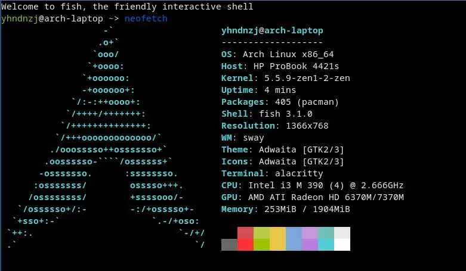
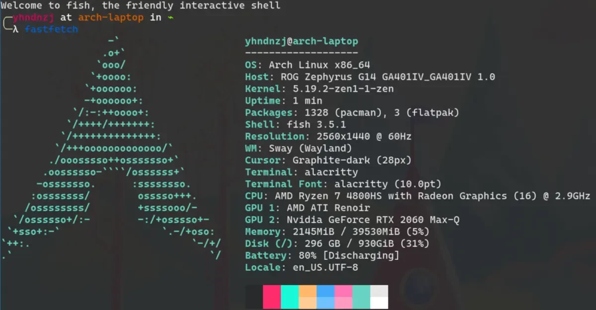

> 距離上一次聊到自己的個人生活，已經過去了兩年半之久（當時還是 2020，新冠疫情剛剛爆發，初三集體上網課的時間呢）；回看那時寫下的記錄從小到大折騰電腦的自己的文字，~~雖然可能有些「中二」（~~，還是令我感慨萬千的（其實是個很懷舊的人））。加之，在初三下學期到準高三的這兩年半的時間裏，還是有許多值得記憶的事情的；而且，在高三~~可能要~~提前開學的當下，這可能是爲數不多的更新 blog 的時間了。於是，或許就算是當作留給以後的自己回憶的材料，今天打算寫下這些文字。
>
> <!-- more -->

> ~~然而又拖到了提前開學後才寫完，不愧是我！~~

說是「近況」，其實這兩年半感受的時間跨度，對於我來說可能比之前的十幾年加起來還長呢（。從初三下學期到高二升高三的暑假，真是發生了許多。以下分小標題（

## 上一次的補完

在上一篇《systemd-oomd 基本使用》的末尾，出現了一臺神祕的超低配筆電。它搭載第一代 Intel 智能酷睿處理器，2 GB 記憶體，來自 2009 年（

這是我人生中第一臺屬於自己的電腦：我爸於 2009 年拿到了公司發放的筆電，由於他已經擁有一臺，就轉贈給了我。誰知，竟還成爲了陪伴我人生最長的一臺（）。在我上次寫完《我的計算機折騰史》的半個月內，我的主力機 *arch-server* 竟然突然去世了……據一年後的排查，應該是我當時使用了 PreLoader enroll hash 的方式實現 Secure Boot，卻並沒有及時清理過期的 hash，而 Gigabyte 當時的 UEFI firmware 存在 bug，居然直接無法引導了……走投無路的我想起了車庫裏來自十年前的筆電，將其翻了出來。雖然是如此垃圾的配置，但好歹是 x86_64——可以裝 Arch！我興高采烈地裝上了 Arch，爲了節省資源，第一次使用了 Wayland (sway)，而當時的 sway 推薦了 alacritty。回頭望去，這也爲我現在的新筆電上的如此組合埋下了伏筆吧（

而 2013 和 2014 年組裝的兩臺電腦，都已被大卸八塊；前者（原本的 *arch-server*）在喫灰，後者經調查，被我通過清空 NVRAM 的方式修好，於 2021 年接替了 arch-server 的職位（不過換回了原始的 i5-4570~~，畢竟根本用不上 4790K（~~

而在初三最後的幾個月裏，我使用這臺筆電堅持了下來（畢竟也沒有太多時間可用/沒什麼事可做），2 GB 記憶體在 Arch + sway 上足夠同時 TG 水羣和 Chromium 上網了（

就這樣，我迎來了中考，~~此處省去一萬字關於體育扣了一堆分所以沒上市區第一的學校的吐槽！~~，也在之後迎來了我人生中第二臺筆電，即我現在的主力機——ASUS ROG Zephyrus G14（幻 14）

## Zephyrus G14

### 購買的想法之起源

在初三最後，盤算着中考後新組一臺臺式機的我，突然看到了 LinusTechTips 的 [幻 14 評測](https://www.youtube.com/watch?v=ZYqG31V4qtA)。其乾淨的外觀和強勁的效能（AMD 吹表示很開心），一下子吸引了我的注意。~~這個小學時代給自己裝了兩臺臺式機的人這次打算偷懶了！（）~~或許這樣一臺筆電也不錯？於是，在中考完的那天（沒等到出成績，因爲怎麼都得換電腦來着（），我迫不及待地下單了 G14。

### 第一次 kernel patch

畢竟是京東，第二天它就到了我的手上。迫不及待地遷移系統（`btrfs device add/remove` 太方便了！）、mkinitcpio、改主機名——開機！熟悉的 KDE 又出現在了我的眼前，陪伴了當時的我一整年的 Arch 換了個身體，繼續陪伴我（🌝。然而，在測試 Steam 的途中，卻出了點意外：每次玩 GTA 5 壓力比較大的時候，CPU 就會突然被鎖定到 400 MHz，只能重啓才能恢復。經過查找，問題出在 `asus-nb-wmi` 這個 kernel module 上——ASUS 筆電通過其來進行部分電源管理（對應 Windows 下的 Armoury Crate），如果沒有正確加載就會導致高負載下自動保護；而且，有些例如顯示卡切換和關閉之類以及鍵盤燈的功能是依賴其才能進行設定的。但其依賴 `i8042` 這個 module，後者似乎是管理 PS/2 設備的，而且如果缺少一些設備就會拒絕加載——而較新的 G14 並沒有那些設備，而因爲太新也沒有被加到忽略列表裏，所以需要 patch kernel 手動加進去。於是，我開啓了自己的第一次~~（除那次失敗的 Gentoo 安裝外）~~kernel patch 之旅。其實當時 AUR 應該已經有 `linux-g14` 這個 kernel 了，但我日常使用的是 `linux-zen`，於是從各方找~~（抄）~~了點 patch，放到了我的 GitHub 上的 [linux-zen-g14](https://github.com/YHNdnzj/linux-zen-g14)，隨後發佈到 AUR。同時，創建了~~年輕人的第一個~~ ArchWiki page [ASUS GA401I](https://wiki.archlinux.org/index.php?title=ASUS_ROG_GA401I&oldid=630624)。至此，問題解決！

但是之後我又發現每次 kernel 發佈新版之後手動跟隨版本號是很麻煩的事…當時也並不知道 [nvchecker](https://github.com/lilydjwg/nvchecker) 這種東西，不得不每次手動更新。等到我快受不了，打算寫個東西來做這些事的時候，發現 5.11 之後大多數 patch 都已被上游接受，剩下的基本不影響使用了。於是，在 2021-08 我 archive 了 `linux-zen-g14`，第一次 kernel patch 之旅完結！

### systemd-homed

作爲一個 systemd 吹（從之前寫的 blog 裏面基本都有 *systemd* 這一 [tag](/tags/systemd) 基本就能看出來（，我在 systemd-homed 出現後不久，便想體驗一下。尤其是我有 YubiKey，配合 FIDO2 還能更方便而安全地解鎖——至少我當時是這麼想的。實際跟隨 [systemd.io](https://systemd.io/CONVERTING_TO_HOMED) 上的指引用 rsync 遷移過去的最後就報了錯：systemd-homed 掛載 home image 的時候是關閉 ACL 的，而我之前的 home 上用到了，所以丟了些權限……而且，創建完之後，出現了 *btrfs on LUKS on btrfs* 的極其尷尬的局面（可以用 btrfs subvolume 但是安全性會下降）。不僅如此，當時出現了掛載時報空間不足、FIDO2 和 PKCS#11 都無法使用的更糟糕情況…本來一切我期待的 feature 全都沒法用。一氣之下，我又換回了 traditional Unix user。整個 systemd 裏面，除了沒用過的 portabled 等不作評價，我最不推薦的就是 homed 了。

> 雖然他們後來修了 [FIDO2 的問題](https://github.com/systemd/systemd/issues/17784)，但我還是不太推薦…效能不如全盤 LUKS，功能不如 PAM 自己配。不過關於全盤 LUKS，那又是另一個故事了（🌚

### btrfs and LUKS and dotfiles and sway

> 想想真是奇怪的四個東西組合，但是對我和我的 Arch 來說這是最重要的轉折點之一，而確實和這四個東西都有很強的關聯，遂合併在一起記錄（

書接上回，扔掉 systemd-homed 之後，爲了保持安全性，我便使用了全盤 LUKS，就這樣安心用了半年。但是，在我用 btrfs 的兩年裏，我慢慢開始想一個問題：我的桌面用途真的需要 btrfs 嗎？在 *arch-server* 上，btrfs 無疑是最好的選擇；但是，在 desktop/laptop 上，無論是備份還是透明壓縮功能，都是極其有限地使用；而例如 swap file 的設定和 subvolume 的結構等問題，反而造成了不少困擾。而 KDE 上，plasma 和 latte-dock（最近還[停止開發](https://psifidotos.blogspot.com/2022/07/latte-dock-farewell.html)了）的小問題都源源不斷，雖然沒有特別巨大的 bug，但還是挺影響日常使用的。中途還爲了嘗試解決一個問題刪了一次家，爲了保留不相關的 config，計劃上也早就想做的 dotfiles 管理 終於開始了實施，參考了 fc 老師的[【譯】使用 GNU stow 管理你的點文件](https://farseerfc.me/using-gnu-stow-to-manage-your-dotfiles.html)，順便附上我的 [repo 連結](https://github.com/YHNdnzj/dotfiles)（一直在活躍更新呢）。結果，刪家也沒有解決問題…而當時我也已經不再追求太多的美化了，覺得更需要效率更高、更少需要滑鼠介入的 WM——而作爲追新派，如果是 Wayland WM 就更好了。這時，回想起在舊 laptop 上的 sway 體驗，覺得反而挺不錯的。於是，把 btrfs 和 KDE 換成 xfs 和 sway 的種子便被種下了。

但是，作爲~~寫博客都天天拖的~~非常能拖延的我，平時對這些問題也就是吐槽幾句，並沒有什麼真正進行大型遷移的動力。然而，升級到 5.17 kernel 之後，出現了非常詭異且使我的系統完全無法使用的問題——freeze。每過不到 30s，整個桌面環境就會 freeze 約 1~2min。可是，我沒有在 kernel msg 中找到任何相關報錯，也嘗試過更換 SSD、在其它電腦上啓動，問題依舊。這時，我便下定決心，進行直到目前爲止最大的更改——換成 xfs on LUKS，同時遷移到 sway。這套組合運行非常良好，xfs 的 reflink 已經足夠桌面日常使用了，同時我也一直很喜歡 sway。只是 sway 的開發週期着實有些長，到現在 [XWayland 縮放](https://gitlab.freedesktop.org/wlroots/wlroots/-/merge_requests/2064) 和 [輸入法彈窗](https://github.com/swaywm/sway/pull/5890) 相關 PR 都沒有被 merge……

### 筆電上的 Linux 遊戲體驗

在《在 systemd-nspawn 上運行 Steam》一文中，我描述了之前在 *arch-desktop* 上我是如何隔離環境遊玩 Steam 遊戲的。然而，在筆電上，就沒有那麼順利了。再加上更換 sway 後，Wayland 環境不便於在 container 中運行 GUI 應用，我便拋棄了這一方法。後來瞭解到 [GPU passthrough](https://wiki.archlinux.org/title/PCI_passthrough_via_OVMF)，鑑於我有獨立顯卡，我也在之後一年內偶爾使用了這種方式遊玩。但是，雖然 GPU 效能損失不大，可是不知爲何 CPU 效能損失達到了玩東方都不能流暢…而且配置起來非常麻煩。所以，最近我決定換用 flatpak，效果卻意外地好。環境配置很方便，也同樣能做到隔離，還能通過 flatseal 直觀地調整共享的文件和應用的權限。這是我目前最推薦的遊玩方式（當然，如果沒有 lib32 潔癖，直接開 *multilib* 跑 `steam-native` 就好了（

> 如果有需要，可以去看皓奇老師的 [使用 systemd-nspawn 容器化 Steam](https://liolok.com/zhs/containerize-steam-with-systemd-nspawn/)，比我的更詳細（甚至有 Game-specific 的問題解決方案
>
> 之前我寫的那些用來管理 nspawn 的 [script](https://github.com/YHNdnzj/dotfiles/commit/12335702a28243e03eba54080f4e6fb3e0d2c5c9) 還能在 dotfiles 裏面找到，如果有需要的話應該依然是可用的（

### 總結

以上，也算是填好了**兩年前**就想寫的 G14 體驗這一大坑（說是電腦體驗，但其實都在說上面的 Arch 的故事（）。要說真正的硬體體驗，那就是除了 Intel 660P，其它絕對是完全值回票價，尤其是最近幾年的 AMD Ryzen CPU 加持下。可擴展性上，有一個 8 GiB 的板載記憶體和一個 DDR4 槽。無線網卡和 NVMe SSD 都可以非常輕鬆地更換，但是沒有 SATA 槽。總之，雖然拖了很久不太好，但是這兩年的使用真的是經歷了許多，也讓我對其有了更深的感情，或許這個時間點來寫也不錯呢。

最後上慣例：

## 以前一些博文的狀態更新

> 鑑於我的更新週期，很多 blog 的狀態都已經過期了，藉此次近況更新的機會也來提一下（

上面已經寫到關於《在 systemd-nspawn 上運行 Steam》的部分了。EFB 的那兩篇來說，我的微信網頁版權限被封了（Sadly），所以確實無法繼續更新了。QQ 倒是有了更好用的新方案，之後打算寫一篇 *efb-qq-ng* 來仔細闡述~~（草，又挖坑）~~。《8 年 Android 老用戶的 iPhone 12 體驗》的話，一年多的使用中 iOS 確實足夠令我滿意。但是，一次 Developer Beta 系統更新需要 12 GiB 儲存空間是不是搞錯了什麼🌚…，而且在 Arch 上也無法透過 iTunes 更新，之後再想辦法吧。《最好的軟路由 Powered By Arch Linux》那個系列的下文還是會出的，但是應該只會到其二——PPPoE 撥號和 Cloudflare DDNS，而且我希望等到 systemd-networkd 支援 PPPoE 後再寫，因爲 pppd 實在是太難用了……以及，我的 nftables 透明代理從來沒有成功過，成功後會有其三的，~~祝我好運（）~~

## 開源社區貢獻

作爲 Arch testing 使用者，在最近兩年間也是參與了一些 bug report、解答問題甚至 PR 等工作的。在 systemd 提了兩個 issue，最近還給 *arch-install-scripts* 提了個 [PR](https://github.com/archlinux/arch-install-scripts/pull/23)，還是有些成就感的🌝

> 即使是高三，也不能停下折騰——生命不息，折騰不止！（（（

## 個人生活的雜談

### 傳教工作

在 2019 年成功勸了一位好友使用 Arch，上個月他也跟隨《最好的軟路由 Powered By Arch Linux（其一：基本網路設定）》搭好了自己的 Arch 軟路由，好！同時上個月還拉攏另一位友人從 EndeavourOS 開始嘗試 Linux，希望最後也能加入 Arch 神教（

## GF

Well，我也不知道爲什麼這樣一個重度拖延症、強迫症、上課睡覺的人真的找到了 Girl Friend🌝🌚🌝🌚🌝🌚~~，不過她真的好可愛啊！~~

一年前的此刻，因爲諮詢 NOI 相關問題認識了她，莫名其妙地向她傳教了 Linux，她居然真的第二天就裝上了，雖然成功地讓 Windows 不能啓動了🌝🌚……然後我在不知道的情況下莫名其妙讓她在她生日那天來我家，修了一天的 Fedora Dual Boot（草）

莫名其妙地傳教成功了 Arch，莫名其妙地一起爲她裝上 Arch 感到超級喜悅。莫名其妙地又在我生日那天讓她來我家，配了一整天 VPS (Shadowsocks)（草！）然後莫名其妙傳教成功了 Telegram，然後……🌝！

一年過去，雖然吵架不可避免，但是有這樣一個人在身邊，而且還有如此相同的愛好和目標，真的令我非常開心；一起出去玩的體驗，也讓我這個 16 年的宅，體驗了許多別樣的快樂。

以後也要一直在一起！

## 結語

這是我有史以來寫過的最長的 blog 了，也是與我個人生活最貼近的一篇。或許她也讓我開朗了一些呢（）

還願意看這個拖延症的 blog 的大家，下次再見！（（（
