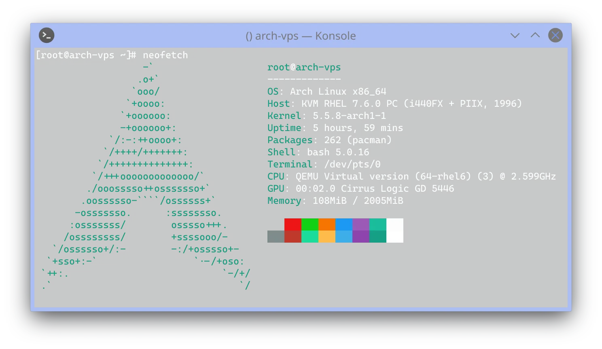
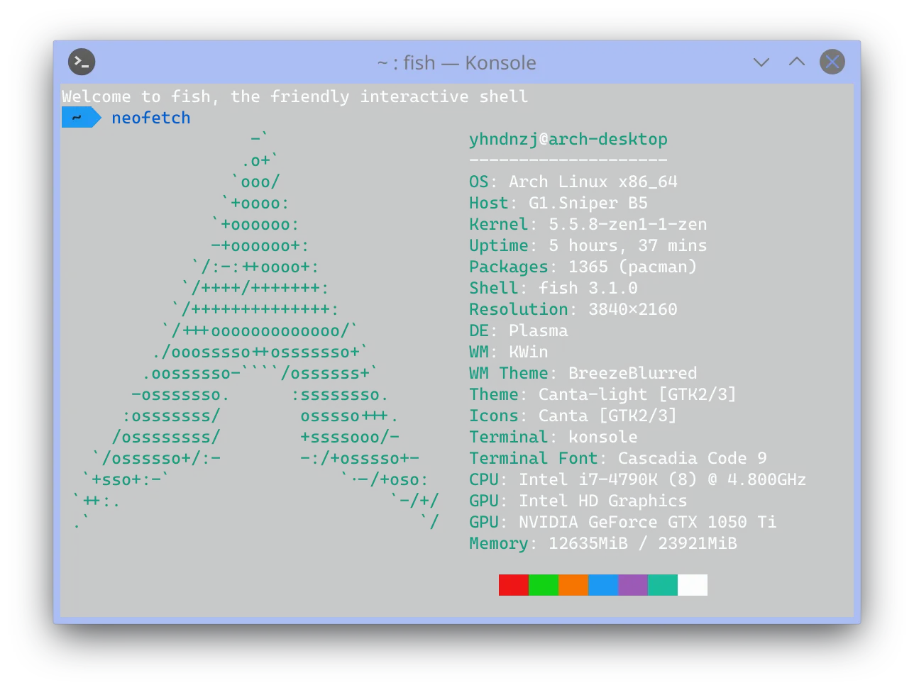
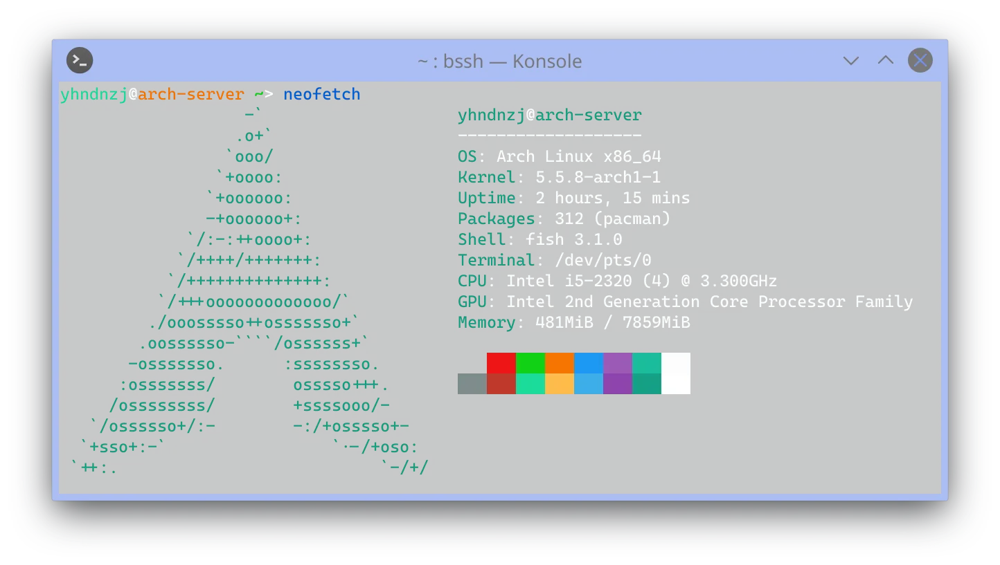

> 生命不息，折騰不止
> <!-- more -->

大約在幼稚園，表哥帶我進了計算機這個坑。還能記得的，就是用 360 把我爸的電腦弄到花屏吧（

小學一年級，父母送我去學習了系統安裝、電腦組裝以及 Flash.

二年級，舅舅送給了我一臺帶有 GMS 的平板電腦，我隨後接觸到了翻牆，並下載了「翻牆路由器」和「自由門」，註冊了第一個 Google Account~~（很快就丟了）~~。 我也得到了一臺海信手機，並使用刷機精靈進行了第一次刷機，成功從 Android 2.3 升級到 Android 4.1. 組裝了第一臺電腦（Sandy Bridge 架構）。

三年級，我接觸到了 Linux（Ubuntu Kylin）。 使用 TWRP 成功爲 Nubia Z5S 刷入 CyanogenMod，開始折騰 Root 和 Xposed. 購買了~~年輕人的第一臺路由器~~——小米路由器 R1D（當時還能直接在管理頁面搭建 LAMP 環境呢（

四年級，組裝了第二臺電腦（Haswell 架構），同時也註冊成爲了第一批 Windows Insider，Linux 換到了 Ubuntu. 當時還不會用 init（好像還是 Upstart），只能將各種自啓動 script 扔到 `/etc/rc.local`（。開始使用 Shadowsocks 服務（機場）。在安裝 NVIDIA 驅動使用了官方的 .run，隨後無法開機~~，在 *CSDN* 找到解決方案：在 grub.cfg 加上 nomodeset（~~。發現開機後解析度只有 1024x768~~，又找到另一篇文章：使用 xrandr 強制設定~~。（黑歷史++（

五年級，第一次嘗試編譯 AOSP，接觸了 Zsh，rEFInd（然而後面全部棄用了，分別換成了 Fish 和 systemd-boot）。

六年級，購買了第一臺 VPS，~~使用 CentOS~~ 搭建了 Shadowsocks Server 和測試用的 WordPress. 學習了一點 Java（現在已經全忘了）。註冊了現在用的 Google Account，購買了 OG Google Pixel. 爲了使用 FCM-for-Mojo 寫了第一個 systemd service（不過是放到 `/lib/systemd/system`……）

初一上學期，我加入了 Telegram。在編譯升級 CentOS 的 glibc 時，不小心刪除了 libc.so.6, 只好重裝系統，換成了 Ubuntu（。 在 VPS 上搭建了 ehForwarderBot 和 ownCloud. 下學期，在嘗試過 Fedora 後，換到了 Arch Linux（其實當時應該聽說過 Manjaro，但還是直接裝了 Arch~~（最正確的選擇~~。一開始用的是 GNOME, 很快換成了 KDE. 接觸 Cloudflare 和 GCP，搭建了 LAMP 環境（當時一直在折騰 HSTS 和 PHP），WordPress (Blog)~~（裏面全是黑歷史）~~，註冊域名 yhndnzj.com.

初二上學期，加入了 ArchCN 羣組但不怎麼發言。棄用了 WordPress. 購買了 Raspberry Pi 3B+，搭建了 Gitee 和 NextCloud~~（現在在吃灰（~~。購買了 CN2 GIA 的 VPS，同樣使用 Arch Linux. 下學期，使用 Hexo 重建了 Blog，同時在桌電上重裝了 Arch Linux，正式（？）加入了 ArchCN 羣。認識了 OriginCode, fc 老師等大佬。K20 Pro 刷入 Pixel Experience 養老。

初三上學期，嘗試了一下 Gentoo，可能還是不適合我吧，很快就刪除了。隨後將 SNB 平臺的那臺電腦作爲了伺服器，並將 EFB 遷移到了上面。

其他使用過的 Linux 發行版：CentOS, Debian, Ubuntu MATE, Linux Mint~~, CDLinux~~

想來我也快要初中畢業了，已經折騰了這麼久了。但是，生命不息，折騰不止！（
