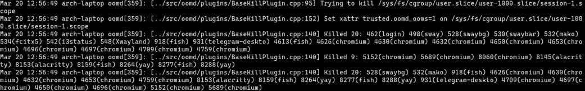

> systemd 247 引入了自己的 OOM killer systemd-oomd（~~「systemd，你個 init 又吞併功能了」~~，瞭解後發現其可以更好地針對 cgroup 進行 OOM 監控/管理。但其文檔並不豐富、缺少示例配置，於是打算介紹一下其基本使用。
>
> <!-- more -->

> 2021 年末本想試着寫年終總結，結果和之前提過的 幻 14 的使用感受、軟路由之後幾篇一起拖到了 2022
>
> 而且看來還要拖很久的樣子（~~其它可以拖，但年終總結是有時間限制的啊~~

> 上段引言是 2022 年 2 月寫的，當時預計可以寫完這篇，結果一路拖到 4 月上網課纔有時間…
>
> （~~這傢伙真能拖~~年終總結什麼的還是別想了（🌚

## 前言：swap 和 cgroup

雖然現代無論是桌機還是筆電的 RAM 都基本 >= 16 GiB，一般不會 OOM，但 swap 空間依然是必要的。[systemd-oomd 的 man page](https://man.archlinux.org/man/systemd-oomd.8#SETUP_INFORMATION) 引用了一篇名爲 *In defence of swap: common misconceptions* 的文章，farseerfc 老師的 blog 有其翻譯：[替 swap 辯護：常見的誤解](https://farseerfc.me/in-defence-of-swap.html)。這在記憶體空間不足時給 systemd-oomd 足夠的時間響應，更對系統穩定性有幫助。如果沒有預留 swap partition，可以根據 ArchWiki 設定 swapfile。

systemd-oomd 依靠 cgroups v2 工作，在 Arch 等搭載較新 systemd 的 distro 上預設啓用。如果使用較老的 distro，可以使用 `systemd.unified_cgroup_hierarchy=1` kernel parameter 啓用。觸發 OOM 時，systemd-oomd 將殺死整個 cgroup 下的進程，所以建議使每個 desktop app 跑在獨立的 cgroup scope 裏。在 GNOME、KDE 等現代 DE 中，這是預設行爲；Sway 使用者可參考 [ArchWiki: Sway#Manage_Sway-specific_daemons_with_systemd](https://wiki.archlinux.org/title/Sway#Manage_Sway-specific_daemons_with_systemd)。

<details>
    <summary>~~兩年前第一次嘗試 sway + userspace OOM killer (oomd) 時的悲劇~~</summary>

    

    

</details>

## 正篇

既然是 systemd 組件，在 Arch 上自然包含在 systemd 包中，配置位於 `/etc/systemd/oomd.conf`。預設配置在我這裏夠用了，沒有進行調整，具體可參考 `man oomd.conf`。

設定完成後直接啓用之：

`# systemctl enable --now systemd-oomd`

接下來到了關鍵部分：systemd-oomd 並不像 oomd 一樣預設對所有 cgroup 啓用。相對地，其需要手動在各 cgroup 上設定策略。根據 [man 5 systemd.resource-control](https://man.archlinux.org/man/systemd.resource-control.5.en)，有以下選項可供使用：

`ManagedOOMMemoryPressure=`：根據記憶體用量進行 OOM kill，閾值在 `ManagedOOMMemoryPressureLimit=` 中指定

`ManagedOOMSwap=`：根據 Swap 用量進行 OOM kill，閾值：`SwapUsedLimitPercent=`

對於 root slice (`-.slice`)，由於會應用到包括 `machine.slice` 等記憶體用量可能較大的 slice 上，建議只對其應用 Swap 用量管理：

```ini
# /etc/systemd/system/-.slice.d/systemd-oomd.conf
[Slice]
ManagedOOMSwap=kill
```

對於 system service：

```ini
# /etc/systemd/system/system.slice.d/systemd-oomd.conf
[Slice]
ManagedOOMMemoryPressure=kill
```

對於用戶級應用：

```ini
# /etc/systemd/system/user@.service.d/systemd-oomd.conf
[Service]
ManagedOOMMemoryPressure=kill
ManagedOOMMemoryPressureLimit=30%
```

對於 `systemd-nspawn` container：

```ini
# /etc/systemd/system/machine.slice.d/systemd-oomd.conf
[Slice]
ManagedOOMMemoryPressure=kill
ManagedOOMMemoryPressureLimit=50%
```

如果需要對某個 unit 禁用 systemd-oomd，可以使用 `ManagedOOMPreference=` 選項。其接受 `avoid` 和 `omit` 參數，前者降低對其進行 OOM kill 的優先級，後者完全忽略。注意由於設計上僅被用於豁免系統關鍵服務，本選項只在所有者爲 root 的 slice 上生效。

接下來 reload systemd 以應用更改：`# systemctl daemon-reload`

要測試效果，可以用 `systemd-run` 開個獨立的 cgroup 跑個編譯什麼的~~，看看會不會失敗（不~~

## 參見

本篇很大程度上參考了 Fedora 的 [EnableSystemdOomd](https://fedoraproject.org/wiki/Changes/EnableSystemdOomd)，有興趣的話可以繼續閱讀。
